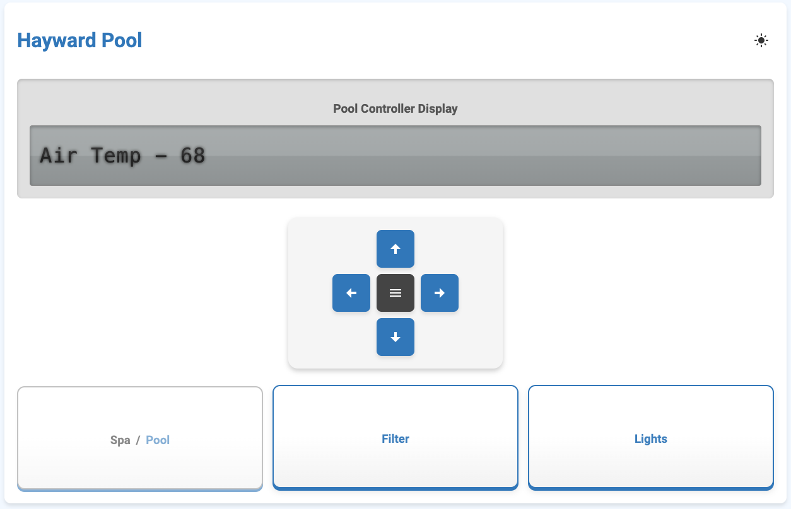

# Pool Controller

This project utilizes the Hayward AquaLogic/ProLogic RS485 communication bus to read the frames sent across and then will allow for manipulation of the pool equipment.  This saved me upwards of $4,500 so I don't have to use the OmniLogic upgrade system.

# Components

Elfin EW11 RS485-Wifi module - http://www.hi-flying.com/elfin-ew10-elfin-ew11
-458x458.jpg)

AquaLogic Board

Note: Check documentation for your version of the EW11 as it might not be the same as the ones above.

EW11 Script

[IOTService Program](http://ftp.hi-flying.com:9000/IOTService/) - To edit the EW11 - SLOW download

Configuration Setup

*	Install the IoTService app on a Windows PC with WiFi access
*	Connect PC WiFi to the EW11 WiFi SSID: EW11_???? (open)
*	Run IOTService app, the device should be found automatically
    * If no device is shown, then the EW11 is not connected to WiFi
    *	The default IP address when in AP mode is: 10.10.100.254
    *	Connection can also be made with web browser

*	Double click device or single click Config, then click Edit on the Device Status window

*	Setup UART/Socket/WiFI sections as shown above
*	Change WiFI mode to “STA”
*	Enter your own local WiFi SSID and Key in the STA entry
*	Optional, change DNS server under System
*	Confirm Settings and determine new EW11 IP address from IOTService
*	Use Export to save a copy of all the settings in case the EW11 settings get wiped. Import will reload all settings.

**Script Load**

*	Connect PC to local area network
*	Run IOTService app, the device should be found automatically
*	Double click device, then click Edit
*	Click on Detail
*	IMPORTANT: Set Gap Time to 10 under UART
*	Click on Edit Script
*	Click on Import Script
*	Download the script (docs/EW11.txt):
*	Select Script, then Confirm

Special thanks to [@swilson](https://github.com/swilson) and [@mas985](https://github.com/mas985) for their fantastic research and code they've made available.

